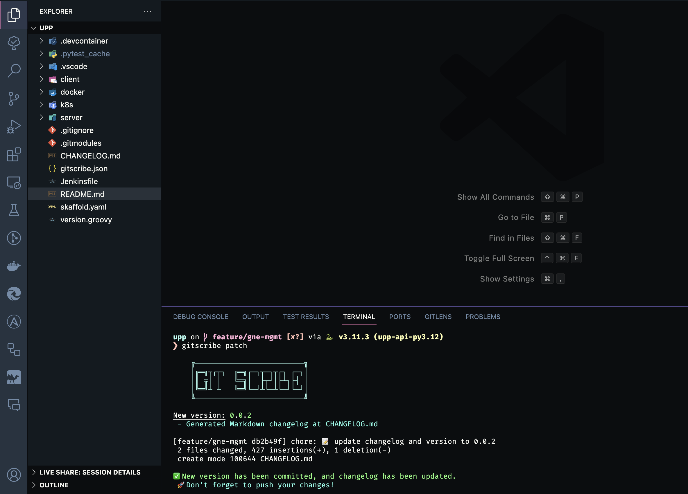

# GitScribe

- A tool to help you maintain a changelog file in your project with semantic versioning.

## Installation

### Requirements

#### rust toolchain

- install from rustup: <https://rustup.rs/>

### install from cates.io

- `cargo install gitscribe`

### For A Better Experience

#### enforce the use of Conventional Commits in your project

- <https://github.com/compilerla/conventional-pre-commit>
  - you need to install the pre-commit tool first: <https://pre-commit.com/#install>

## Usage

```sh
gitscribe --help
```

### make a new release

```sh
# depending on the changes you made, you can use the following commands to make a new release version
gitscribe patch | minor | major
```

behind the scenes, it will do the following:

- if no config file is found, it will create a new one
- update the version in gitscribe.json
- update or create a new changelog file
  - default file name is CHANGELOG.md and is placed in the root of the project
- add and commit the changes


As seen above, you must have a clean working tree.

Below you can see a successful example



With the default configuration you get a new markdown changelog generated at the root of your project and new commit on your working branch that is a `chore` commit with the new version.

This tool will **only** output valid commits following conventional commit spec.

### Setting aliases

to make it easier to use, you can set an alias in your shell configuration file

```sh
alias gs="gitscribe"
```

## features

- [x] create a new changelog file

- [x] create multiple changelog files for different output formats

- [x] sync other package management files (pyproject.toml, package.json, cargo.toml) with the gitscribe.json version.

- [ ] more to come..
